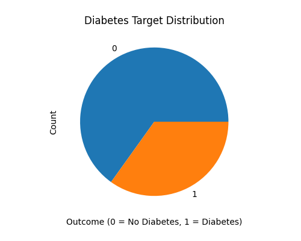
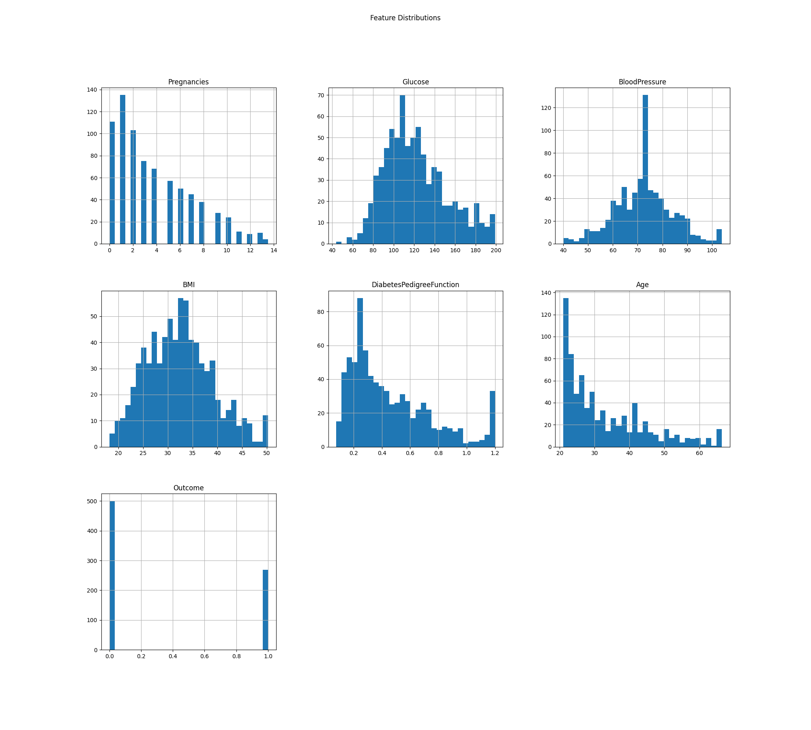
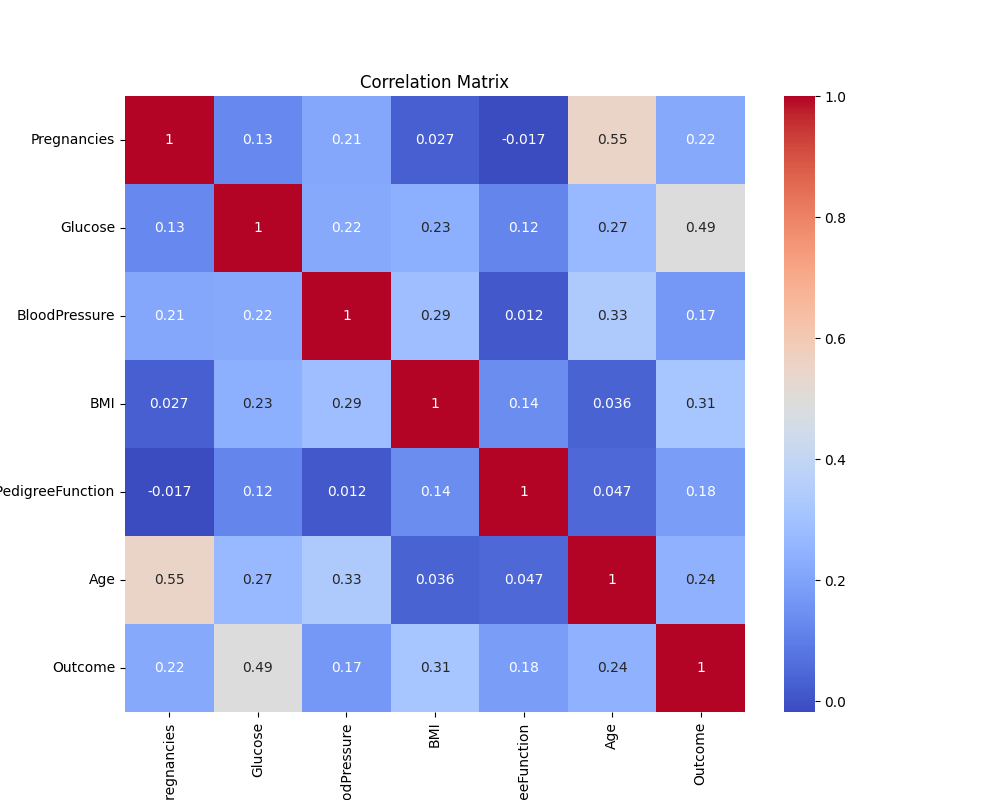
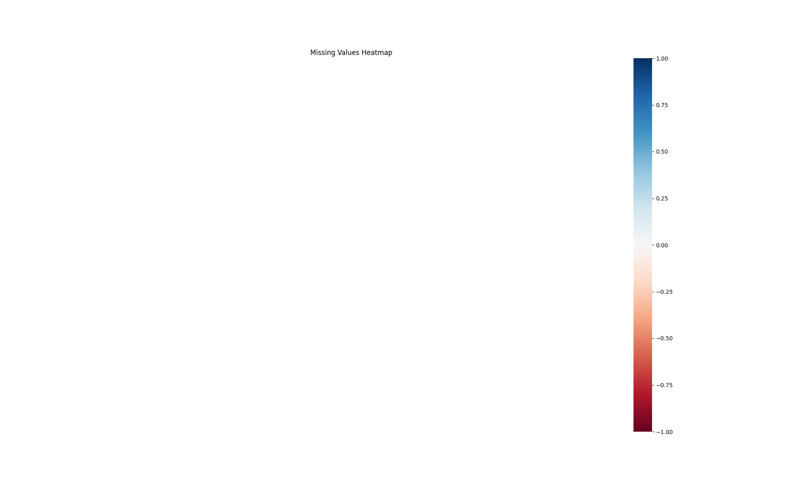
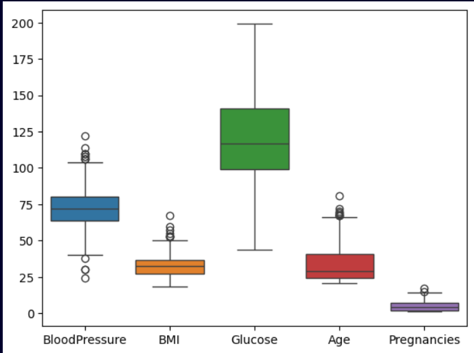

# Data Report for the dataset 

## Dataset 

```
https://www.kaggle.com/datasets/uciml/pima-indians-diabetes-database
```

## Target Distribution


## Feature Distribution


## Correlation Matrix


## Missing Value Heatmap

### *Missing value heatmap empty because of no empty values

## Outlies before clipping


## Outlies after clipping


---

### Outlier clipping is used in the data pipeline instead of outlier removal because of low training samples in data set.

```
 df[col] = df[col].clip(lower, upper)
```