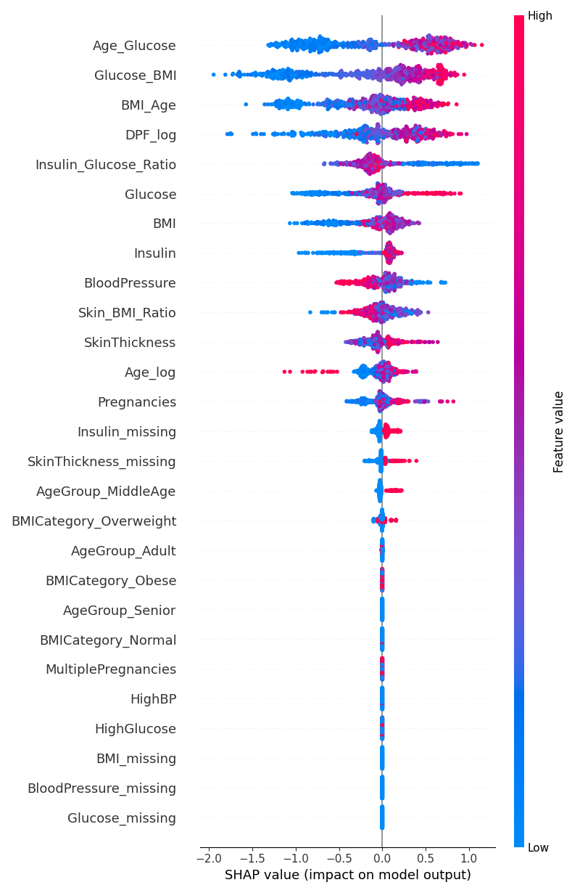

# Feature Engineering 

## Features Created - 10

1. Age Group
2. BMI Category
3. High Glucose
4. HighBP
5. BMI Age
6. Insulin Glucose Ration
7. Multiple Pregnancies
8. Skin BMI Ration
9. Glucose BMI
10. Age Glucose

